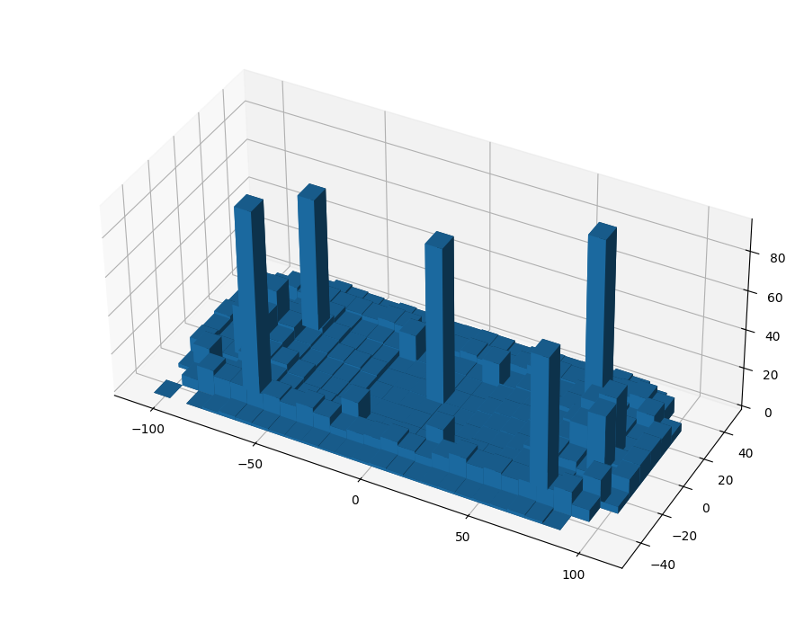
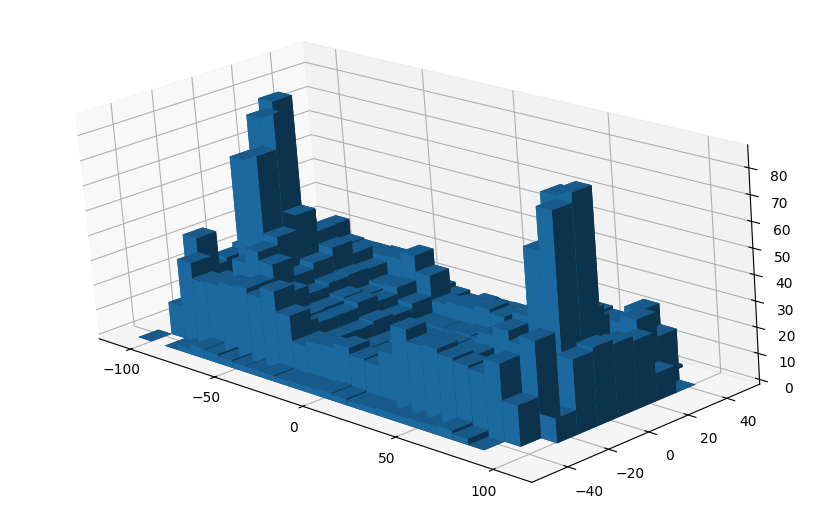
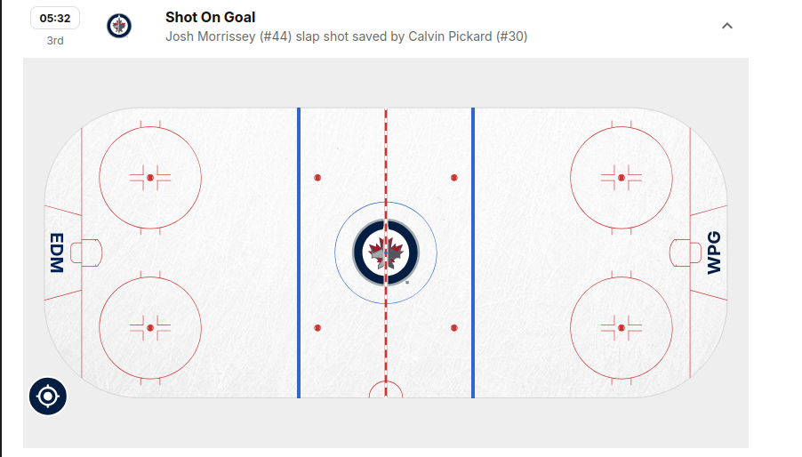

# Pi Day

Hello everyone, I've been super busy recently (should I be doing my coursework? shut up) and so was completely unprepared for Pi day. That being said, it did not mean that I didn't think about ideas that I could pursue to celebrate pi day. I think after last year, I realised that a lot of common methods for calculating pi (at least in a fun way) have already been done a lot. So I think a lot of the novelty of calculating pi comes from the way you sample data randomly. Be that via shotgun, hot dogs or flipping coins.

Over the past few months (as my friends will reliably tell you), I have been getting really quite into ice hockey (go caps!). So this felt like a good way to sample data. In fact, this was something I realised the other week, when I was looking at the data sets for each game to see if I could track how a single player was doing (Brady Tkachuk count your days, I *am* hate watching your stats). What I find really cool is that they track where things happen on the ice, from shots on goal, to penalties to even the mysterious and rare "failed-shot-attempt" (coming from shootouts or a penalty shot).

I thought it would be fun to try the dartboard monte carlo method to estimate pi using these pseudo-random points on the ice (heavy on the *pseudo* (we'll get onto that)). I threw together some very rough code and fetched the data from NHL games starting from the first of January last year, right up to the games yesterday. I then grabbed the coordinates of each event which had them and threw it into matplotlib, just to see roughly what was going on. It's quite a mess, but also very clearly biased... which I decided to ignore (to some degree).

 <figure style="display: block; margin-left: auto; margin-right: auto; width: 50%">
    
    <figcaption>Frequency of events over the ice. Large peaks, where the faceoff dots are.</figcaption>
 </figure>

 
It is clear that some data should be discarded. For example, faceoffs always occur in one of the same 6 spots across the ice, similarly failed shot attempts occur more often in front of the net. I got rid of both of these, but to be honest the rest of the data is mostly random (ish), at least if we take the right subset of it.

<figure style="display: block; margin-left: auto; margin-right: auto; width: 50%">
    
    <figcaption>Frequency of events over the ice (cleaned up).</figcaption>
</figure>

I decided to take a subsection of the data from roughly in front of the net. Then we cut out a square and the circle that fits inside the square, then the ratio of points in the circle to points in the square converges to \(\pi/4\). Implementing this into my code, and sampling over both the defending and offensive sides of the rink, we get the following.

\\[
    3.167986961100263
\\]

Wow, that's better than last year... Which is... something.

Woohoo!

#### Bonus Section

Some curiosities in the data.

<ul>
    <li>
        There was a weird misplaced slap shot.

        <figure>
        
        </figure>

    </li>
    <li>Goals that occured, which weren't hit from the offensive zone. My favourite being <a href="https://www.nhl.com/video/min-edm-draisaitl-scores-goal-against-marc-andre-fleury-6365026472112">this one</a>.</li>
</ul>

